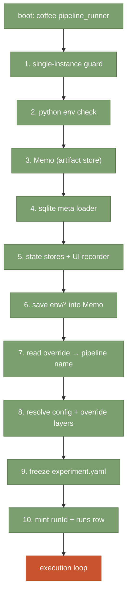

# pipeline_runner — architecture at a glance

## Purpose
`pipeline_runner.coffee` is the whole engine. It reads a recipe,
resolves its steps' inputs and outputs, orders them by dependency,
runs each in turn, and records every side effect so an interrupted
run can be resumed.

**Click any box** to reveal its long-form explanation below.

## Startup phases

Before any step fires, the runner completes a fixed 10-phase boot.
Any failure here aborts before touching a step script.



<details data-flow-node="s1">
<summary>1. Single-instance guard</summary>

If another `pipeline_runner.coffee` is alive in this pipe, mark this
run `skipped` in `state/ui-run.json` and exit 0. Prevents two runs
writing to the same `state/` and `out/` in parallel. Alive detection
uses PID + kill(0); a stale lock is cleared automatically.
</details>

<details data-flow-node="s2">
<summary>2. Python env check</summary>

Checks the pipe's `.venv/bin/python` exists and imports the packages
listed in `requirements.txt`. Fails the run loudly if MLX or a
required wheel is missing — the runner won't lie and start a step
that would blow up on first import.
</details>

<details data-flow-node="s3">
<summary>3. Memo — the artifact store</summary>

Plain in-memory key/value that steps read from and write to via
`L.param`, `L.needs`, `L.make`, `L.saveThis`, `L.theLowdown`. Not a
database — a typed accessor over an object. Every artifact declared
in the recipe's `artifacts:` table gets one key here.
</details>

<details data-flow-node="s4">
<summary>4. Sqlite meta loader</summary>

Loads `<EXEC>/meta/index.coffee`. If the pipe has a `runtime.sqlite`,
this wires the Memo so certain `saveThis`-key patterns automatically
project into sqlite tables (see [`../meta/`](../meta/) and the
request-key doc). If not present, no-op — sqlite is optional.
</details>

<details data-flow-node="s5">
<summary>5. State stores + UI recorder</summary>

`StepStateStore` writes one `state/step-<name>.json` per step
(status, timestamps, error). `UiRecorder` writes `state/ui-run.json`
(current state) and appends `state/ui-events.jsonl` (event stream
the UI tails live).
</details>

<details data-flow-node="s6">
<summary>6. save env/* into Memo</summary>

`EXEC`, `CWD`, `PYTHON`, `PYTHON_VERSION`, `REQUIREMENTS_TXT`,
`MLX_PACKAGES`, `HH_MM`, `LOGDIR`. Steps can read any of these via
`L.theLowdown('env/EXEC')` etc. — no scattered `process.env` reads.
</details>

<details data-flow-node="s7">
<summary>7. Recipe selection</summary>

The pipe's `control_override.yaml` wins over its `override.yaml`.
Both are checked for a `pipeline:` key. If neither has one, exit 1.
</details>

<details data-flow-node="s8">
<summary>8. Config + override layers</summary>

Three-tier walk: `<CWD>/config/<recipe>.yaml` → `<BASE>/config/` →
`<EXEC>/config/`. First hit wins. Same order for override layers, so
a pipe shadows a project override, which shadows the framework
default.
</details>

<details data-flow-node="s9">
<summary>9. Freeze experiment.yaml</summary>

The merged recipe (post-overrides) is written back to
`experiment.yaml` in the pipe dir. This is the human-readable record
of what THIS run actually saw. Diff two `experiment.yaml`s to see
what changed between runs.
</details>

<details data-flow-node="sA">
<summary>10. runId + runs table row</summary>

Mint a UUID for the run. Save it into `state/ui-run.json` for the UI
and into the `runs` table via a `runRegister{…}.json` request-key so
downstream steps can foreign-key back to this run.
</details>

<details data-flow-node="sB">
<summary>Execution loop — the L object + resume + disk layout</summary>

Once boot succeeds, the runner picks steps off the DAG in
topological order and executes them one at a time. See the second
diagram below for the step-level flow; click its boxes for detail.

Parallelism is opt-in per-step (`parallel: true`); the default is
sequential.
</details>

## Execution loop

```mermaid
flowchart LR
  poll["pick next ready step"]:::exec
  ledger[/"read state/step-&lt;name&gt;.json"/]:::io
  skip{"already done<br/>and not stale?"}:::guard
  loadScript["require step script"]:::exec
  buildL["build L object"]:::exec
  action["await step.action(L)"]:::exec
  makes["L.make → disk + Memo + sqlite"]:::io
  done["state = done"]:::io
  loop{{"more ready?"}}:::guard
  finish["mark run done"]:::exec

  poll --> ledger --> skip
  skip -->|yes| loop
  skip -->|no| loadScript --> buildL --> action --> makes --> done --> loop
  loop -->|yes| poll
  loop -->|no| finish

  click poll showFlowchartDetail
  click ledger showFlowchartDetail
  click skip showFlowchartDetail
  click loadScript showFlowchartDetail
  click buildL showFlowchartDetail
  click action showFlowchartDetail
  click makes showFlowchartDetail
  click done showFlowchartDetail
  click loop showFlowchartDetail
  click finish showFlowchartDetail

  classDef exec  fill:#C9532C,color:#fff,stroke:#9A3E1E,stroke-width:1px;
  classDef io    fill:#3D4147,color:#F0EDE5,stroke:#22262A,stroke-width:1px;
  classDef guard fill:#D4A343,color:#3D2E11,stroke:#A67F26,stroke-width:1px;
```



<details data-flow-node="poll">
<summary>Ready-step selection</summary>

A step is "ready" when every entry in its `depends_on:` list has a
`state/step-<dep>.json` with `status: done`. The runner picks
alphabetically among ready steps by default; a step can declare
`parallel: true` to run concurrently with its siblings (rare — most
recipes are serial).
</details>

<details data-flow-node="ledger">
<summary>The step ledger</summary>

Every step has one file at `state/step-<name>.json` recording its
status, timestamps, and error message. The runner reads this on
boot to decide skip vs re-run. Delete the file to force a re-run;
add `restart_here: true` to it to force from that step forward.
</details>

<details data-flow-node="skip">
<summary>Skip-or-run guard</summary>

If the step's state file says `done` AND every artifact it made
still exists on disk with an mtime newer than the step's
`finished_at`, the runner fast-forwards. Otherwise it runs the step.
</details>

<details data-flow-node="loadScript">
<summary>Loading the step script</summary>

The recipe's `run:` field names a coffee file relative to
`<EXEC>/scripts/` (usually). The runner `require`s it and expects
`@step = { desc, action: (L) -> ... }`.
</details>

<details data-flow-node="buildL">
<summary>Building the L object</summary>

`L` is the runner's stable API. Everything a step is allowed to do
goes through it:

| method | purpose |
|---|---|
| `L.param(name, default)` | read a param from the recipe (post-override) |
| `L.needs(artifactName)` | read an upstream artifact |
| `L.make(artifactName, value)` | write an artifact — disk + Memo + sqlite |
| `L.saveThis(key, value)` | write a memo entry with sqlite semantics |
| `L.theLowdown(key)` | read a memo entry back |
| `L.callLLM({op, ...})` | in-process node-mlx call (the fast, newer path) |
| `L.callMLX(op, ...)` | subprocess call to `python -m mlx_lm` (older) |
| `L.done()` | mark this step complete |
</details>

<details data-flow-node="action">
<summary>await step.action(L)</summary>

The step's `action` is called with the L object and awaited. A step
that throws or rejects gets its state file marked `failed` with the
error message; the run halts unless the recipe declares
`on_failure: continue`.
</details>

<details data-flow-node="makes">
<summary>Where artifacts land</summary>

`L.make('spine_text', ...)` looks up `spine_text` in the recipe's
`artifacts:` table, gets the target path (e.g.
`out/spine_diary.txt`), writes the value there, caches it in the
Memo, and (if meta wiring exists) projects it into `runtime.sqlite`.
Downstream steps' `L.needs('spine_text')` returns instantly.
</details>

<details data-flow-node="done">
<summary>Marking a step done</summary>

`state/step-<name>.json` gets `status: done`, `finished_at`, and any
declared outputs. The UI's step ledger tail picks it up
immediately.
</details>

<details data-flow-node="loop">
<summary>Loop continuation</summary>

The runner re-evaluates readiness. Steps that were blocked on the
just-completed step may now be ready. Loop exits when no ready
steps remain.
</details>

<details data-flow-node="finish">
<summary>Run completion</summary>

`ui-run.json.status` flips to `succeeded` (or `failed` if any step
failed and no `on_failure: continue`). The `runs` table row is
updated with `finished_at`. The daemon's UI shows the terminal
state; any watchers streaming `state/ui-events.jsonl` receive the
final event.
</details>

## Disk layout

<details data-flow-node="disk">
<summary>Where every file lives</summary>

```
<pipe>/
├── control_override.yaml   ← highest-precedence, ephemeral (UI writes here)
├── override.yaml           ← project-authored, durable
├── override/<recipe>.yaml  ← per-recipe durable overrides
├── experiment.yaml         ← frozen snapshot of THIS run's merged config
├── data/                   ← inputs (user-authored)
├── params/                 ← per-run staged parameters
├── out/                    ← declared artifacts (from `artifacts:` table)
├── state/
│   ├── step-<name>.json    ← one file per step; ledger for resume
│   ├── ui-run.json         ← live status for the UI
│   ├── ui-events.jsonl     ← append-only event stream
│   └── pipeline_state.json ← death record (set on crash)
├── logs/                   ← stdout / stderr for the whole run
└── runtime.sqlite          ← optional; meta layer writes projections here
```
</details>

## Pointers to subsystem docs

- Meta subsystem (sqlite request keys, projections) — [`../meta/README.md`](../meta/README.md)
- Panel registry (UI panel discovery) — [`../GPT/ui/panels.md`](../GPT/ui/panels.md)
- Model calls (`callLLM` vs `callMLX`) — [`../GPT/newLlm_fork.md`](../GPT/newLlm_fork.md)
- Hooks / cron / cool-down — [`../GPT/scheduling_helper.md`](../GPT/scheduling_helper.md)
