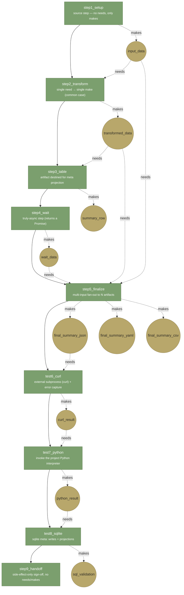

# test

## Purpose
The **teaching recipe** for the pipeline runner. Nine steps, each
chosen to demonstrate a different runner mechanism, run end-to-end
in under a minute. Read this flowchart to learn what a step block
does, how `needs` / `makes` wires artifacts, and where each kind of
side effect lives.

Recipe source: [`../config/test.yaml`](../config/test.yaml). Step
scripts live in [`../scripts/test/`](../scripts/test/) (one
`step*_*.coffee` per step).

## Inputs

None. The recipe is self-contained — `step1_setup` generates its own
seed data. No `UI_*` fields in the recipe; nothing to fill in.

## Steps

Each step demonstrates ONE mechanism (labeled inside the node).
`depends_on` (order) drawn as solid arrows; `needs`→`makes`
(artifact flow) drawn as dotted arrows so the two wires stay
visually distinct.

### What the runner does at each arrow

- **Solid arrow (`-->`)** — `depends_on`. The runner enforces
  ordering: a step never fires before its dependencies' state files
  say `done`. This is topological scheduling.
- **Dotted arrow (`-.needs./makes.->`)** — artifact flow. `needs`
  entries become filesystem reads (or SQLite reads) at step start;
  `makes` entries become writes routed through `L.make(name, value)`.
  The runner resolves each artifact name to the `target:` path
  declared in the `artifacts:` block.
- The runner writes one `state/step-<name>.json` per step. That
  file is how the UI's step ledger knows what happened.

### The nine mechanisms in one paragraph

Step 1 has no upstream — a **source**. Step 2 is the workhorse
shape — read one, write one. Step 3 writes an artifact that the
sqlite meta layer will project into a table. Step 4 returns a
`Promise` — proving the runner awaits truly-async work. Step 5
consumes THREE artifacts and emits THREE — fan-in, fan-out, and
multi-format output in one shot. Step 6 spawns a subprocess (curl)
and captures its exit + stderr into an artifact so failures land in
the ledger, not the void. Step 7 does the same with the project's
Python interpreter — the runner knows where `.venv/bin/python`
lives. Step 8 exercises the sqlite meta layer end-to-end: writes
rows, reads projections, validates request keys. Step 9 has neither
`needs` nor `makes` — it's a side-effect-only sign-off, and shows
that the runner tolerates pure imperative steps.

## Outputs

| artifact | target | format |
|---|---|---|
| `input_data` | `out/tested/input.json` | JSON, seed data |
| `transformed_data` | `out/tested/transformed.json` | JSON |
| `summary_row` | `out/tested/table.json` | JSON, one row for meta projection |
| `wait_data` | `out/tested/wait.json` | JSON, proves async completed |
| `final_summary_json` | `out/tested/final_summary.json` | JSON |
| `final_summary_yaml` | `out/tested/final_summary.yaml` | YAML — same data, different container |
| `final_summary_csv` | `out/tested/final_summary.csv` | CSV — same data, tabular |
| `curl_result` | `out/tested/curl_result.json` | exit code + captured output |
| `python_result` | `out/tested/python_result.json` | exit code + captured output |
| `sql_validation` | `out/tested/sql_validation.json` | pass/fail of sqlite exercises |

## Logs

- **stdout** — `logs/test_<HH_MM>.log`
- **stderr** — `logs/test_<HH_MM>.err`

Per-step state files land in `state/step-<step_name>.json`. The
runner reads these on startup to decide which steps to skip on a
resume. Delete a step's state file to force it to re-run on the
next launch.

## SQLite

Step 8 is where `runtime.sqlite` gets exercised. Reads the
projections declared by `artifacts:` entries and validates that
meta request-keys resolve. All other steps are file-only; sqlite is
optional for a recipe. When you see a recipe with no `test8`-like
step, it means that pipe's `runtime.sqlite` is not touched by that
recipe (see `spine_*.yaml` for the None case).
